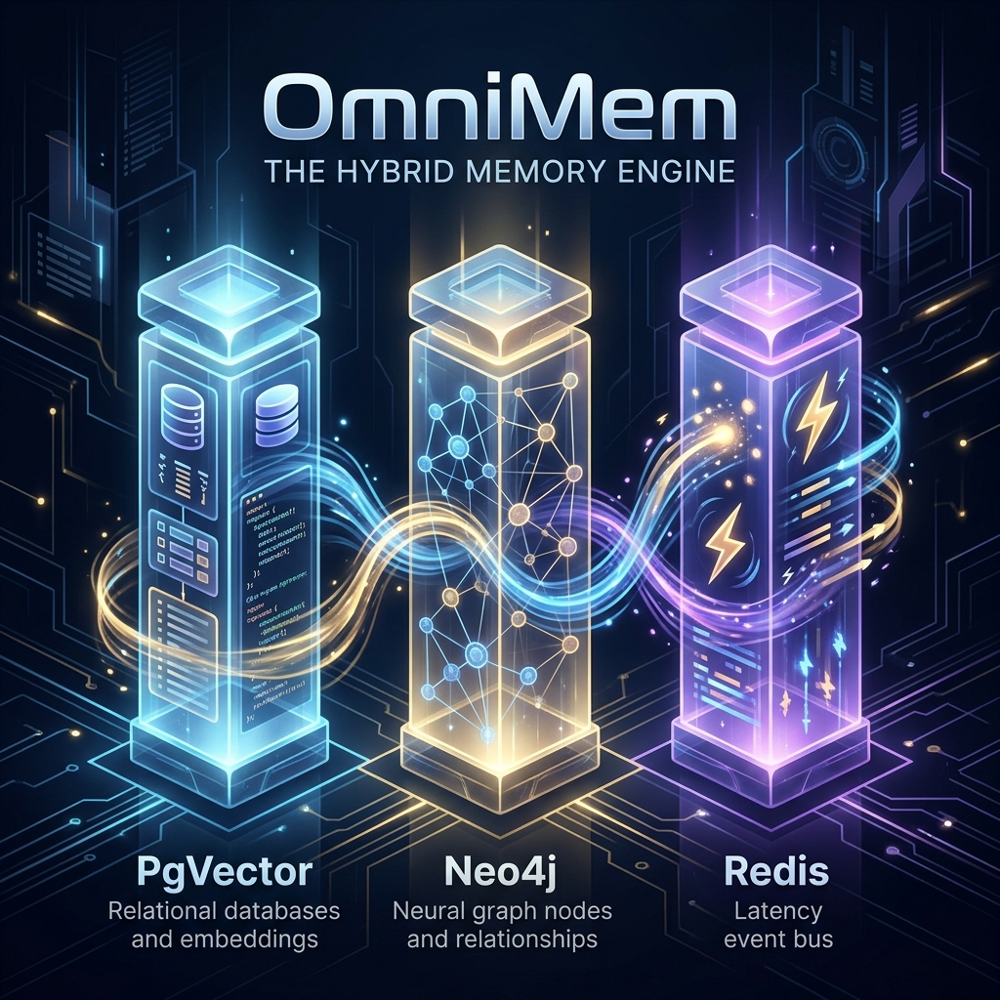
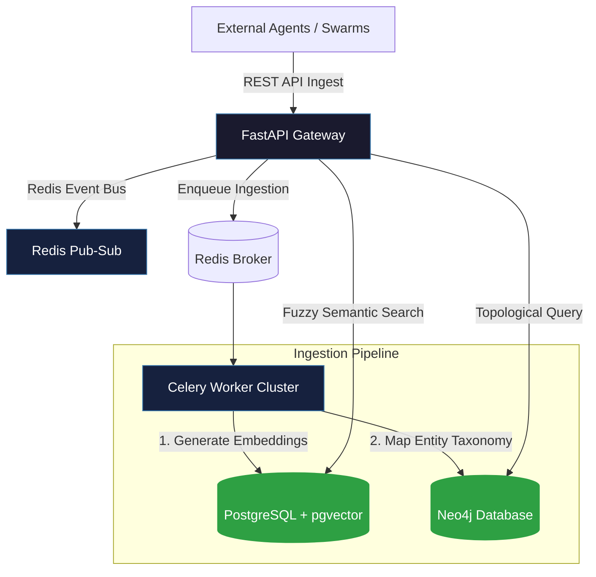

<div align="center">
  
</div>

<br>

<div align="center">

[](https://github.com/axtontc/OmniMem/releases)
[](https://python.org)
[](LICENSE)
[](https://github.com/axtontc/OmniMem/actions)

</div>

<br>

<h1 align="center">🌐 OmniMem — Hybrid Graph-Vector Memory Storage Engine</h1>

<p align="center">
  <strong>An enterprise-grade hybrid storage engine designed for infinite, structured agentic memory. Integrates high-dimensional pgvector semantic searches, Neo4j topological relationships, and a low-latency Redis event bus with celery orchestration.</strong>
</p>

<p align="center">
  <a href="#-quickstart">Quickstart</a> •
  <a href="#-the-paradigm-shift">The Paradigm Shift</a> •
  <a href="#%EF%B8%8F-cli-reference">CLI Reference</a> •
  <a href="#-architecture">Architecture</a> •
  <a href="#-core-subsystems">Subsystems</a> •
  <a href="#-api--core-functions-reference">API Reference</a> •
  <a href="#-comparison-matrix">Comparison Matrix</a> •
  <a href="#-roadmap">Roadmap</a>
</p>

---

## 💡 The Paradigm Shift

Autonomous agent swarms fail when their memory systems are fragmented. Semantic vector indexes are excellent at matching fuzzy phrases but fail at structural taxonomy (e.g., retrieving related components or tracking organizational hierarchy). Graph databases match connections perfectly but lack fuzzy conceptual search.

**OmniMem** bridges this divide by presenting a unified, high-performance hybrid memory system:
1. **Graph-Vector Convergence**: Integrates pgvector semantic matching and Neo4j graph schemas to query and update both layers atomically.
2. **Asynchronous Ingestion**: Utilizes Celery task queues backed by Redis to parse massive datasets, files, and codebases in the background.
3. **Canary-Token Security Firewall**: Enforces a strict schema verification boundary (`security_contract.py`) that filters out canary leak vectors, persona hijacks, and prompt injections.
4. **Idempotent IPC WAL**: Provides a transactional Write-Ahead Log wrapper with cross-platform OS file locks to ensure zero write loss under heavy concurrency.

---

## ⚡ Quickstart

### Prerequisites
- **Python 3.11+**
- **Docker & Docker Compose**
- **uv** (recommended for rapid dependency syncing)

### 1. Clone & Setup
```bash
git clone https://github.com/axtontc/OmniMem.git
cd OmniMem

# Sync virtual environment using uv
uv sync
```

### 2. Verify with the Test Suite
Run the 38-spec test suite locally (includes mocks for Redis, databases, and WAL logs):
```bash
uv run python -m pytest tests/ -v
```

---

## 🛠️ CLI Reference

### 1. Deploy the Cluster
Start the entire database and networking stack (PostgreSQL with pgvector, Neo4j, Redis, workers, and FastAPI application) in Docker container mode:
```bash
omnimem up
```

### 2. Launch FastAPI Server Only
Spawns the local web server hosting ingestion and search HTTP endpoints:
```bash
omnimem server --port 8000
```

### 3. Launch Celery Worker Only
Launches the asynchronous ingestion worker cluster:
```bash
omnimem worker
```

---

## 🏗 Architecture



---

## 🏗️ Core Subsystems

| Subsystem | Folder / File | Responsibility |
|---|---|---|
| **API Interface Gateway** | `omnimem/api.py` | FastAPI server hosting `/search`, `/search_graph`, and `/ingest` endpoints |
| **CLI Entrypoint** | `omnimem/cli.py` | CLI route handling (`up`, `server`, `worker` routing commands) |
| **pgvector Storage Layer** | `omnimem/pgvector_layer.py` | Database initializer, embedding search index creator, and Postgres writer |
| **Neo4j Graph Layer** | `omnimem/neo4j_layer.py` | Connects bolt drivers and performs keyword-based topological subgraph retrievals |
| **Write-Ahead Log (WAL)** | `omnimem/wal.py` & `ipc_wal.py` | Asynchronous file-locked transactional logging with idempotency keys |
| **Canary Security Boundary** | `omnimem/security_contract.py` | Rigid validation models filtering Canary leakage, hijacks, and prompt injections |
| **Queue Workers** | `omnimem/tasks.py` | Asynchronous Celery routines writing to graph and vector engines |

---

## 📖 API & Core Functions Reference

### `omnimem/pgvector_layer.py`
These functions handle vector-embedding relational storage:

| Function / Method | Parameters | Description |
|---|---|---|
| `MemoryDB.create(dsn)` | `str` | Class method initializing database pools and creating the `semantic_memory` tables. |
| `search_semantic_memory(embedding, limit, max_distance)` | `List[float]`, `int`, `float` | Queries cosine similarity via HNSW index returning matching memory structures. |

### `omnimem/neo4j_layer.py`
These routines drive Neo4j graph storage and traversal:

| Function / Method | Parameters | Description |
|---|---|---|
| `Neo4jDatabase.execute_query(query, params)` | `str`, `dict` | Runs arbitrary queries and transaction parameters asynchronously. |
| `search_graph(keywords, limit)` | `List[str]`, `int` | Runs Cypher queries matching node IDs containing keywords along with neighboring relationships. |

### `omnimem/wal.py`
Provides transactional persistence guarantees:

| Function / Method | Parameters | Description |
|---|---|---|
| `FileLock.acquire()` | None | Cross-platform OS-level lock (msvcrt on Windows, fcntl on Unix) with timeouts. |
| `AsyncWAL.append(data, txid)` | `dict`, `str` | Logs data asynchronously, flushing in batches to disk under file locking. |

---

## 📊 Comparison Matrix

| Feature | Standard PG | neo4j-only | pgvector-only | **OmniMem** |
|---|:---:|:---:|:---:|:---:|
| **Semantic Ingestion Queue** | ❌ | ❌ | ❌ | **✅ Yes (Celery + Redis)** |
| **Graph-Vector Joint Storage** | ❌ | ❌ | ❌ | **✅ Yes (PgVector + Neo4j)** |
| **Canary Protection Firewall** | ❌ | ❌ | ❌ | **✅ Yes (`security_contract.py`)** |
| **Transactional Write Lock** | ⚠️ SQL-only | ⚠️ Cypher-only | ⚠️ SQL-only | **✅ Yes (Cross-platform WAL)** |
| **Query Latency** | Variable | <10ms | <5ms | **⚡ High performance (<5ms vector, <10ms graph)** |

---

## 🧰 Tech Stack

* **API Engine**: FastAPI / Uvicorn
* **Task Queue**: Celery / Redis
* **Relational/Vector DB**: PostgreSQL + pgvector
* **Graph DB**: Neo4j (bolt transport)
* **Testing & Lints**: pytest (with fakeredis), Ruff, mypy
* **Model Inference**: sentence-transformers (`all-MiniLM-L6-v2`)

---

## 🗺️ Roadmap

- [x] Dual storage engine mapping (pgvector + Neo4j)
- [x] Redis-based event bus publishing
- [x] Pydantic-based Canary and Injection validation models
- [x] Celery asynchronous batch pipeline ingestion
- [x] Cross-platform file locking and Async WAL manager
- [ ] **Dynamic Graph Construction** — Automate node extraction from raw embeddings using LLM relationship discovery tasks
- [ ] **WAL Compact Compaction** — Implement CRDT Tombstones memory compaction on logs
- [ ] **Kubernetes Helm Charts** — Production-ready deployment manifest files for AWS/GCP clusters

---

## 🔗 Ecosystem Cross-Linking

OmniMem is the backbone memory storage provider for the Antigravity Swarm ecosystem:

| Project | Description |
|---|---|
| [AUI](https://github.com/axtontc/AUI) | Zero-latency cross-process UI automation for Windows and Web |
| [MemMCP](https://github.com/axtontc/MemMCP) | Stdio-transport memory server using SQLite WAL and FAISS RRF |
| [The-Skillbrary](https://github.com/axtontc/The-Skillbrary) | FastMCP skill execution server and registry |
| [Multiverse-Planner](https://github.com/axtontc/Multiverse-Planner) | Brute-forces optimal plans via timeline expansion and pruning |
| [Fractal-Swarm-v2](https://github.com/axtontc/Fractal-Swarm-v2) | Mathematically optimal state-machine agent swarm orchestration |
| [AntiMem](https://github.com/axtontc/AntiMem) | SQLite compactor and local daemon mapping memories into context |
| [The-Sentinel-Reviewer](https://github.com/axtontc/The-Sentinel-Reviewer) | Code quality gatekeeper running static audits, tests, and deep traces |

---

## 📜 License & Copyright

This project is licensed under the Apache License, Version 2.0. See the [LICENSE](LICENSE) file for details. Copyright (c) 2026 Axton Carroll.

---

<div align="center">
  <br>
  <strong>⭐ If OmniMem helps scale your enterprise memory storage, consider giving it a star!</strong>
  <br>
  <br>
  <a href="https://github.com/axtontc/OmniMem">
    
  </a>
  <br>
  <br>
  <sub>Built by <a href="https://github.com/axtontc">Axton Carroll</a> — "Nothing is impossible, we merely don't know how to do it yet."</sub>
</div>
