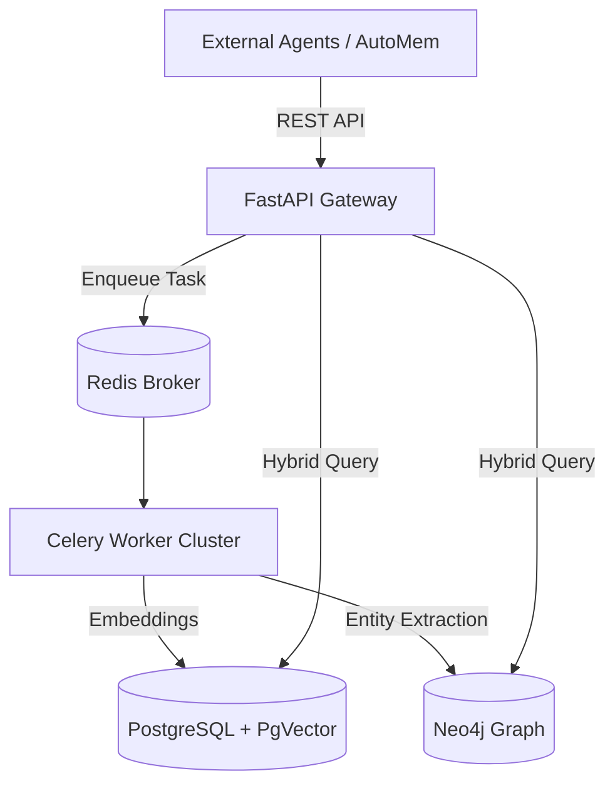

<div align="center">

# 🌐 OmniMem
**The Enterprise Graph-Vector Storage Engine for Infinite Agent Memory**

<p align="center">
  
  
  
  
  
</p>

<p align="center">
  <b>Tags:</b> <code>pgvector</code> <code>postgresql</code> <code>semantic-search</code> <code>memory-injection</code> <code>agentic-memory</code>
</p>

</div>

---

## ⚡ What is OmniMem?

**OmniMem** is an industrial-grade backend data ingestion pipeline designed for infinite autonomous memory. It bridges the gap between semantic similarity (Vector Databases) and structural relationships (Graph Databases).

Built on FastAPI and Celery, OmniMem ingests raw text, codebases, and massive datasets, instantly converting them into high-dimensional embeddings via `PgVector` while simultaneously linking their ontological relationships in `Neo4j`.

### 🌟 Enterprise Features

- **🛡️ Graph-Vector Hybrid Engine**: Query memories by semantic similarity (PgVector) AND relational taxonomy (Neo4j) for hallucination-free retrieval.
- **⚡ High-Throughput Ingestion**: FastAPI gateway backed by a Redis/Celery asynchronous task queue capable of parsing gigabytes of raw knowledge.
- **🚀 Docker-Native Orchestration**: Spins up PostgreSQL, Neo4j, Redis, Celery Workers, and the API Gateway in a single cohesive `docker-compose` cluster.
- **🔍 Intelligent Ontology Mapping**: Automatically extracts named entities and structural nodes during ingestion to build an ever-expanding graph of ground-truth knowledge.

---

## 🏗️ Architecture



---

## 🚀 Quick Start

### Installation

```bash
git clone https://github.com/axtontc/omnimem.git
cd omnimem
pip install .
```

### Starting the Cluster

Deploy the entire microservice architecture with one command:

```bash
omnimem up
```
*(This automatically spawns Postgres, Neo4j, Redis, the API, and Celery Workers).*

---

## ⚙️ Configuration & Advanced Usage

<details>
<summary><b>Click to expand advanced CLI options</b></summary>

You can explicitly control the microservices if you prefer not to use `omnimem up`:

- **Start API Server Only**: `omnimem server`
- **Start Celery Worker Only**: `omnimem worker`
- **Database URIs**: Configured internally via `.env` but defaults to standard Docker ports (5432, 7687, 6379, 8000).

</details>

---

## 🔒 Licensing & Enterprise Support

> [!CAUTION]
> **Commercial Use Prohibited**
> 
> OmniMem is dual-licensed. This public repository is distributed under the **PolyForm Noncommercial License 1.0.0**. You are free to use, modify, and distribute this software for personal, hobbyist, and academic non-profit use.
>
> **You may NOT use this software for commercial purposes or within a corporate enterprise environment without purchasing a commercial license.**
>
> If you are a corporation interested in leveraging OmniMem for your data pipelines, please contact **Axton Carroll** for commercial licensing and dedicated enterprise support.
